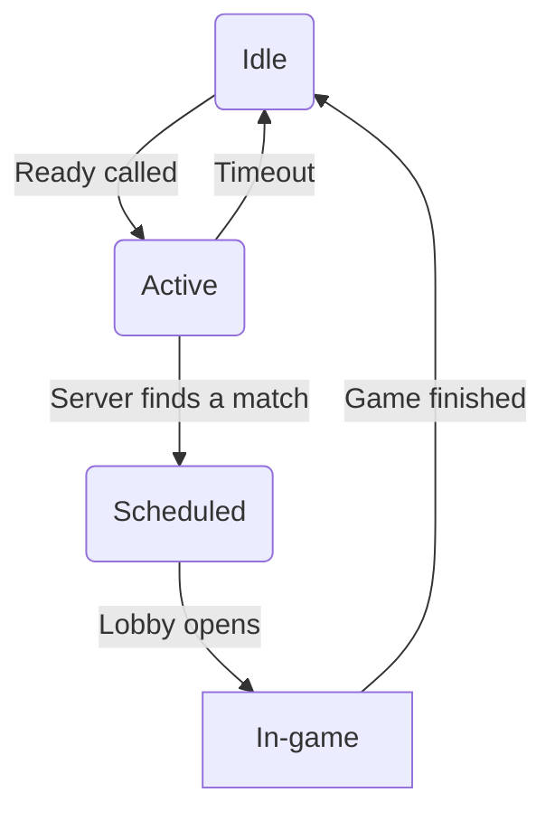

# Tic-Tac-Tournament

Multiplayer Code vs. Code Tic-Tac-Toe server.

## Gameplay

Each player gets an `ID` and some form of authentication (token for example) from the event organizers.

`Active` player clients call the Ready API to signal their presence. The server automatically creates lobbies and organizes matches.

`Scheduled` players should only call `Get grid`, until the game starts. When the game lobby is ready and `running`, players become `in-game`, and should call `Get grid` and `Place` to play the game.

When a lobby's status changes to `finished`, all players must call `Ready` to indicate they are ready again.

### Player states

The basic logic behind a client's state.

- Idle: the player/client is evaulating the results, or just plain offline. It can enter the player queue by calling `Ready`.
- Active: the client application is up and running, ready to play. It got a valid response from the server, but no match is organized. Should call `Ready` periodically to check if a match is ready.
- Scheduled: the server has a game lobby ready for both players. Match starts at a predefined time. Clients should only call `Get grid` periodically to get the state of the lobby.
- In-game: the lobby is open, the game is on! Call the `Get grid` to get the state (mark positions, if it's your turn). If it's your turn, a single `Place` call places the player's mark. Call `Get grid` to get the result. If the game finished, both players go back to the `Idle` state.

### Game arena

The coordinates follow the Cartesian coordinate system, and addressed as indexes: bottom-left 0;0, top right 2;2

| Cooord |         |         |
| ------- | ------- | ------- |
| X:0 Y:2 | X:1 Y:2 | X:2 Y:2 |
| X:0 Y:1 | X:1 Y:1 | X:2 Y:1 |
| X:0 Y:0 | X:1 Y:0 | X:2 Y:0 |

## API

### Get player information

`GET /playerinfo/{ID}`

Returns the most important upcoming game info and player statistics.

- when the next game is scheduled (?)
- wins and losses count

### Ready

`GET /ready/{ID}`

Signal the server, that the player is ready for a match, like a heartbeat. Authentication required.

Authentication: add your `token` to the HTTP header.

Recommended refresh period: 1-60s. Players idling for more than 60s will be marked as `inactive`.

If the player is scheduled for a match, the response includes a timestamp and lobby ID.

### Get grid

`GET /getgrid/{lobby ID}`

Get grid status. Response includes
- current game map
- status (pending, running, finished)
- if the player is expected to place its mark

A client's reaction time is measured from the first `Get grid` call, when it's expected to make a move.

### Place

`POST /place/{lobby ID}`

Place the player's mark.

Timeout, or placing the mark on an illegal coordinate immediately ends the round and the opponent wins.

### Scores

`GET /getscores/`

Retrieves the scores for all players.

Scores are also available on the `/scores/` page, but you can use this API endpoint to fetch them Automated if you want to display scores directly in your game.